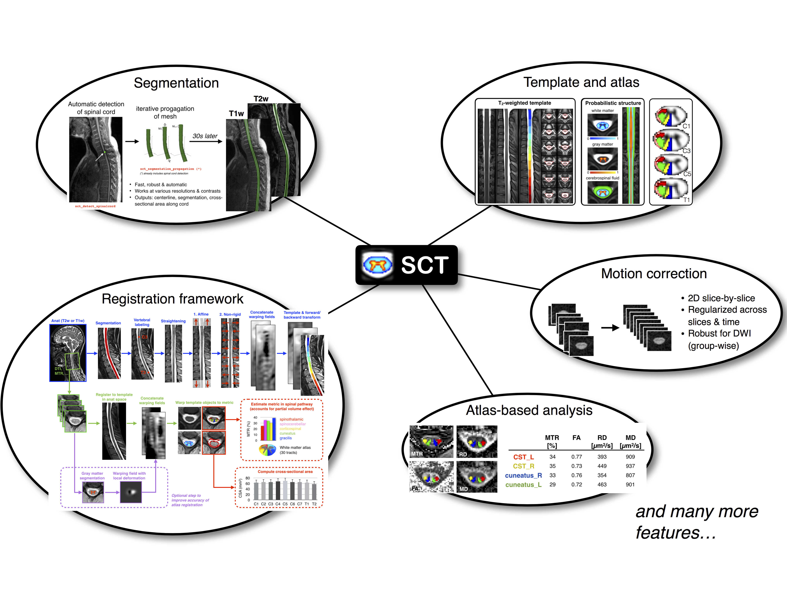

SCT is a comprehensive, free and open-source software dedicated to the processing and analysis of spinal cord MRI data.

- [Introduction](#introduction)
- [List of tools](http://sourceforge.net/p/spinalcordtoolbox/wiki/tools/)
- [Installation](#installation)
- [Getting started](#getting-started)
- [Courses](#courses)
- [Video tutorials](#video-tutorials)
- [References](#references)
- [How to cite SCT](#citing-spinalcordtoolbox)
- [Contributors](#contributors)
- [License](#license)

## Introduction

For the past 25 years, the field of neuroimaging has witnessed the
development of several software packages for processing multi-parametric
magnetic resonance imaging (mpMRI) to study the brain. These software packages
are now routinely used by researchers and clinicians, and have contributed to
important breakthroughs for the understanding of brain anatomy and function.
However, no software package exists to process mpMRI data of the spinal cord.
Despite the numerous clinical needs for such advanced mpMRI protocols (multiple
sclerosis, spinal cord injury, cervical spondylotic myelopathy, etc.),
researchers have been developing specific tools that, while necessary, do not
provide an integrative framework that is compatible with most usages and that is
capable of reaching the community at large. This hinders cross-validation and
the possibility to perform multi-center studies.

**Spinal Cord Toolbox (SCT)** is a comprehensive, free and open-source software dedicated to the
processing and analysis of spinal cord MRI data. **SCT** builds on
previously-validated methods and includes state-of-the-art MRI templates and
atlases of the spinal cord, algorithms to segment and register new data to the
templates, and motion correction methods for diffusion and functional time
series. **SCT** is tailored towards standardization and automation of the
processing pipeline, versatility, modularity, and it follows guidelines of
software development and distribution. Preliminary applications of **SCT** cover
a variety of studies, from cross-sectional area measures in large databases of
patients, to the precise quantification of mpMRI metrics in specific spinal
pathways. We anticipate that **SCT** will bring together the spinal cord
neuroimaging community by establishing standard templates and analysis
procedures.

## Installation

### Install from package (release)

The simplest way to install SCT is to do it via a stable release. First, download the [latest release](https://github.com/neuropoly/spinalcordtoolbox/releases). Major changes to each release are listed [here](CHANGES.md).

Dependencies:
- OS requirements:
  * OS X >= 10.12
  * Debian >=9
  * Ubuntu >= 16.04
  * Fedora >= 19
  * RedHat/CentOS >= 7
  * Windows, see [Installation with Docker](#installation-with-docker).
- You need to have `gcc` installed. On OS X, we recommend installing [Homebrew](https://brew.sh/) and then run `brew install gcc`. On Linux, we recommend installing it via your package manager. For example on Debian/Ubuntu: `apt install gcc`, and on CentOS/RedHat: `yum -y install gcc`. 

Once you have downloaded SCT, unpack it (note: Safari will automatically unzip it). Then, open a new Terminal, go into the created folder and launch the installer:

~~~
./install_sct
~~~

### Install from Github (development)

Download source code from Github (N.B. you need to have git installed):

~~~
git clone --branch=master https://github.com/neuropoly/spinalcordtoolbox.git sct
~~~

Then install SCT:

~~~
cd sct
./install_sct
~~~

At anytime, you can update your local SCT installation to the latest version on Github:

~~~
git pull
~~~

### Installation with Windows Subsystem for Linux (Windows 10).

Windows subsystem for Linux (WSL) is available on Windows 10 and it makes it possible to run native Linux programs, such as SCT. 

[Tutorial to install SCT on WSL](https://github.com/neuropoly/spinalcordtoolbox/wiki/SCT-on-Windows-10:-Installation-instruction-for-SCT-on-Windows-subsytem-for-linux)

### Installation with Docker

If none of the above solution work, SCT can be installed via Docker. 

[Tutorial to install SCT via Docker](https://github.com/neuropoly/spinalcordtoolbox/wiki/testing#run-docker-image)

## Getting started

The best way to learn about the main functionalities of SCT is to run a typical processing pipeline, in the form of a 
batch script. We provide an example dataset (includes T1w, T2w, T2\*w, DTI and fMRI) with a collection of commands to 
process those files and output quantitative parameters.

- Open a Terminal
- Run: `$SCT_DIR/batch_processing.sh`
- While the processing is being done, we encourage you to look at the [batch script](batch_processing.sh) and try to understand the mean of each command line. If you have any question, please do not hesitate to post on the [forum](http://forum.spinalcordmri.org/c/sct).

If you would like to get more examples about what SCT can do, please visit [this address](https://github.com/sct-pipeline/).
Each repository is a pipeline dedicated to a specific research project.

## Courses

We organize **free** SCT courses, each year after the ISMRM conference. If you'd like to be added to the mailing list, please send an email to `spinalcordtoolbox@gmail.com`. The past courses handouts are listed below:

* [SCT course (v4.2.1), London, 2020-01-21](https://www.icloud.com/keynote/0th8lcatyVPkM_W14zpjynr5g#SCT%5FCourse%5F20200121) | [Video recording](https://www.youtube.com/watch?v=whbtjYNtHko&feature=youtu.be)
* [SCT course (v4.0.0), Beijing, 2019-08-02](https://osf.io/arfv7/) | [Slides with Chinese translation](https://osf.io/hnmr2/)
* [SCT course (v4.0.0_beta.4), London, 2019-01-22](https://osf.io/gvs6f/)
* [SCT course (v3.2.2), Paris, 2018-06-12](https://osf.io/386h7/)
* [SCT course (v3.0.3), Honolulu, 2017-04-28](https://osf.io/fvnjq/)
* [SCT course (v3.0_beta14), Geneva, 2016-06-28](https://sourceforge.net/p/spinalcordtoolbox/wiki/Home/attachment/SCT_Course_20160628.pdf)
* [SCT course (v3.0_beta9), Singapore, 2016-05-13](https://drive.google.com/file/d/0Bx3A13n3Q_EAa3NQYjBOWjhjZm8/view?usp=sharing)
* [SCT course (v3.0_beta1), Montreal, 2016-04-19](https://drive.google.com/file/d/0Bx3A13n3Q_EAenltM2ZvZUNEdjQ/view?usp=sharing)
* [SCT Hands-on Workshop (v2.0.4), Toronto, 2015-06-15](https://www.dropbox.com/s/f9887yrbkcfujn9/sct_handsOn_20150605.pdf?dl=0)

## Video tutorials

Please visit our video tutorials [here](https://www.youtube.com/channel/UC3o_1ar-yenIlKfuNHitLqw).

## References

#### Spinal Cord Toolbox
- [De Leener B, Levy S, Dupont SM, Fonov VS, Stikov N, Louis Collins D, Callot V, Cohen-Adad J. SCT: Spinal Cord Toolbox, an open-source software for processing spinal cord MRI data. Neuroimage 2017.](https://www.ncbi.nlm.nih.gov/pubmed/27720818)

#### Template and Atlas
- [Taso et al. Construction of an in vivo human spinal cord atlas based on high-resolution MR images at cervical and thoracic levels: preliminary results. MAGMA, Magn Reson Mater Phy 2014](https://www.ncbi.nlm.nih.gov/pubmed/24052240)
- [Cadotte et al. Characterizing the Location of Spinal and Vertebral Levels in the Human Cervical Spinal Cord. AJNR Am J Neuroradiol 2014](https://www.ncbi.nlm.nih.gov/pubmed/25523587)
- [Fonov et al. Framework for integrated MRI average of the spinal cord white and gray matter: The MNI-Poly-AMU template. Neuroimage 2014.](https://www.ncbi.nlm.nih.gov/pubmed/25204864)
- [Lévy et al. White matter atlas of the human spinal cord with estimation of partial volume effect. Neuroimage 2015](https://www.ncbi.nlm.nih.gov/pubmed/26099457)
- [De Leener B, Fonov VS, Louis Collins D, Callot V, Stikov N, Cohen-Adad J. PAM50: Unbiased multimodal template of the brainstem and spinal cord aligned with the ICBM152 space. Neuroimage 2017.](http://www.sciencedirect.com/science/article/pii/S1053811917308686)

#### Segmentation
- [De Leener et al. Robust, accurate and fast automatic segmentation of the spinal cord. Neuroimage 2014](https://www.ncbi.nlm.nih.gov/pubmed/24780696)
- [Ullmann et al. Automatic labeling of vertebral levels using a robust template-based approach. Int J Biomed Imaging 2014](http://downloads.hindawi.com/journals/ijbi/2014/719520.pdf)
- [De Leener et al. Automatic segmentation of the spinal cord and spinal canal coupled with vertebral labeling. IEEE Transactions on Medical Imaging 2015](https://www.ncbi.nlm.nih.gov/pubmed/26011879)
- [Dupont SM, De Leener B, Taso M, Le Troter A, Stikov N, Callot V, Cohen-Adad J. Fully-integrated framework for the segmentation and registration of the spinal cord white and gray matter. Neuroimage 2017](https://www.ncbi.nlm.nih.gov/pubmed/27663988)
- [Perone et al. Spinal cord gray matter segmentation using deep dilated convolutions. Sci Rep 2018](https://www.nature.com/articles/s41598-018-24304-3)
- [Gros et al. Automatic spinal cord localization, robust to MRI contrasts using global curve optimization. Med Image Anal 2018](https://www.sciencedirect.com/science/article/pii/S136184151730186X)
- [Gros et al. Automatic segmentation of the spinal cord and intramedullary multiple sclerosis lesions with convolutional neural networks. Neuroimage 2019](https://www.sciencedirect.com/science/article/pii/S1053811918319578)

#### Registration
- [Cohen-Adad et al. Slice-by-slice regularized registration for spinal cord MRI: SliceReg. Proc ISMRM 2015](https://www.dropbox.com/s/v3bb3etbq4gb1l1/cohenadad_ismrm15_slicereg.pdf?dl=0)
- [Taso et al. A reliable spatially normalized template of the human spinal cord--Applications to automated white matter/gray matter segmentation and tensor-based morphometry (TBM) mapping of gray matter alterations occurring with age. Neuroimage 2015](https://www.ncbi.nlm.nih.gov/pubmed/26003856)
- [De Leener B et al. Topologically-preserving straightening of spinal cord MRI. J Magn Reson Imaging 2017](https://www.ncbi.nlm.nih.gov/pubmed/28130805)

#### Applications
- [Kong et al. Intrinsically organized resting state networks in the human spinal cord. PNAS 2014](http://www.pnas.org/content/111/50/18067.abstract)
- [Duval et al. In vivo mapping of human spinal cord microstructure at 300mT/m. Neuroimage 2015](https://www.ncbi.nlm.nih.gov/pubmed/26095093)
- [Yiannakas et al. Fully automated segmentation of the cervical cord from T1-weighted MRI using PropSeg: Application to multiple sclerosis. NeuroImage: Clinical 2015](https://www.ncbi.nlm.nih.gov/pubmed/26793433)
- [Taso et al. Anteroposterior compression of the spinal cord leading to cervical myelopathy: a finite element analysis. Comput Methods Biomech Biomed Engin 2015](http://www.tandfonline.com/doi/full/10.1080/10255842.2015.1069625)
- [Eippert F. et al. Investigating resting-state functional connectivity in the cervical spinal cord at 3T. Neuroimage 2016](https://www.ncbi.nlm.nih.gov/pubmed/28027960)
- [Weber K.A. et al. Functional Magnetic Resonance Imaging of the Cervical Spinal Cord During Thermal Stimulation Across Consecutive Runs. Neuroimage 2016](http://www.ncbi.nlm.nih.gov/pubmed/27616641)
- [Weber et al. Lateralization of cervical spinal cord activity during an isometric upper extremity motor task with functional magnetic resonance imaging. Neuroimage 2016](https://www.ncbi.nlm.nih.gov/pubmed/26488256)
- [Eippert et al. Denoising spinal cord fMRI data: Approaches to acquisition and analysis. Neuroimage 2016](https://www.ncbi.nlm.nih.gov/pubmed/27693613)
- [Samson et al., ZOOM or non-ZOOM? Assessing Spinal Cord Diffusion Tensor Imaging protocols for multi-centre studies. PLOS One 2016](http://journals.plos.org/plosone/article?id=10.1371/journal.pone.0155557)
- [Taso et al. Tract-specific and age-related variations of the spinal cord microstructure: a multi-parametric MRI study using diffusion tensor imaging (DTI) and inhomogeneous magnetization transfer (ihMT). NMR Biomed 2016](https://www.ncbi.nlm.nih.gov/pubmed/27100385)
- [Massire A. et al. High-resolution multi-parametric quantitative magnetic resonance imaging of the human cervical spinal cord at 7T. Neuroimage 2016](https://www.ncbi.nlm.nih.gov/pubmed/27574985)
- [Duval et al. g-Ratio weighted imaging of the human spinal cord in vivo. Neuroimage 2016](https://www.ncbi.nlm.nih.gov/pubmed/27664830)
- [Ljungberg et al. Rapid Myelin Water Imaging in Human Cervical Spinal Cord. Magn Reson Med 2016](https://www.ncbi.nlm.nih.gov/pubmed/28940333)
- [Castellano et al., Quantitative MRI of the spinal cord and brain in adrenomyeloneuropathy: in vivo assessment of structural changes. Brain 2016](http://brain.oxfordjournals.org/content/139/6/1735)
- [Grabher et al., Voxel-based analysis of grey and white matter degeneration in cervical spondylotic myelopathy. Sci Rep 2016](https://www.ncbi.nlm.nih.gov/pubmed/27095134)
- [Talbott JF, Narvid J, Chazen JL, Chin CT, Shah V. An Imaging Based Approach to Spinal Cord Infection. Semin Ultrasound CT MR 2016](http://www.journals.elsevier.com/seminars-in-ultrasound-ct-and-mri/recent-articles)
- [McCoy et al. MRI Atlas-Based Measurement of Spinal Cord Injury Predicts Outcome in Acute Flaccid Myelitis. AJNR 2016](http://www.ajnr.org/content/early/2016/12/15/ajnr.A5044.abstract)
- [De Leener et al. Segmentation of the human spinal cord. MAGMA. 2016](https://www.ncbi.nlm.nih.gov/pubmed/26724926)
- [Cohen-Adad et al. Functional Magnetic Resonance Imaging of the Spinal Cord: Current Status and Future Developments. Semin Ultrasound CT MR 2016](http://www.sciencedirect.com/science/article/pii/S088721711630049X)
- [Ventura et al. Cervical spinal cord atrophy in NMOSD without a history of myelitis or MRI-visible lesions. Neurol Neuroimmunol Neuroinflamm 2016](https://www.ncbi.nlm.nih.gov/pubmed/27144215)
- [Combes et al. Cervical cord myelin water imaging shows degenerative changes over one year in multiple sclerosis but not neuromyelitis optica spectrum disorder. Neuroimage: Clinical. 2016](http://www.sciencedirect.com/science/article/pii/S221315821730150X)
- [Battiston et al. Fast and reproducible in vivo T1 mapping of the human cervical spinal cord. Magn Reson Med 2017](http://onlinelibrary.wiley.com/doi/10.1002/mrm.26852/full)
- [Panara et al. Spinal cord microstructure integrating phase-sensitive inversion recovery and diffusional kurtosis imaging. Neuroradiology 2017](https://link.springer.com/article/10.1007%2Fs00234-017-1864-5)
- [Martin et al. Clinically Feasible Microstructural MRI to Quantify Cervical Spinal Cord Tissue Injury Using DTI, MT, and T2*-Weighted Imaging: Assessment of Normative Data and Reliability. AJNR 2017](https://www.ncbi.nlm.nih.gov/pubmed/28428213)
- [Martin et al. A Novel MRI Biomarker of Spinal Cord White Matter Injury: T2*-Weighted White Matter to Gray Matter Signal Intensity Ratio. AJNR 2017](https://www.ncbi.nlm.nih.gov/pubmed/28428212)
- [David et al. The efficiency of retrospective artifact correction methods in improving the statistical power of between-group differences in spinal cord DTI. Neuroimage 2017](http://www.sciencedirect.com/science/article/pii/S1053811917305220)
- [Battiston et al. An optimized framework for quantitative Magnetization Transfer imaging of the cervical spinal cord in vivo. Magnetic Resonance in Medicine 2017](http://onlinelibrary.wiley.com/doi/10.1002/mrm.26909/full)
- [Rasoanandrianina et al. Region-specific impairment of the cervical spinal cord (SC) in amyotrophic lateral sclerosis: A preliminary study using SC templates and quantitative MRI (diffusion tensor imaging/inhomogeneous magnetization transfer). NMR Biomed 2017](http://onlinelibrary.wiley.com/doi/10.1002/nbm.3801/full)
- [Weber et al. Thermal Stimulation Alters Cervical Spinal Cord Functional Connectivity in Humans. Neurocience 2017](http://www.sciencedirect.com/science/article/pii/S0306452217307637)
- [Grabher et al. Neurodegeneration in the Spinal Ventral Horn Prior to Motor Impairment in Cervical Spondylotic Myelopathy. Journal of Neurotrauma 2017](http://online.liebertpub.com/doi/abs/10.1089/neu.2017.4980)
- [Duval et al. Scan–rescan of axcaliber, macromolecular tissue volume, and g-ratio in the spinal cord. Magn Reson Med 2017](http://onlinelibrary.wiley.com/doi/10.1002/mrm.26945/full)
- [Smith et al. Lateral corticospinal tract damage correlates with motor output in incomplete spinal cord injury. Archives of Physical Medicine and Rehabilitation 2017](http://www.sciencedirect.com/science/article/pii/S0003999317312844)
- [Prados et al. Spinal cord grey matter segmentation challenge. Neuroimage 2017](https://www.sciencedirect.com/science/article/pii/S1053811917302185#f0005)
- [Peterson et al. Test-Retest and Interreader Reproducibility of Semiautomated Atlas-Based Analysis of Diffusion Tensor Imaging Data in Acute Cervical Spine Trauma in Adult Patients. AJNR Am J Neuroradiol. 2017 Oct;38(10):2015-2020](https://www.ncbi.nlm.nih.gov/pubmed/28818826)
- [Kafali et al. Phase-correcting non-local means filtering for diffusion-weighted imaging of the spinal cord. Magn Reson Med 2018](http://onlinelibrary.wiley.com/doi/10.1002/mrm.27105/full)
- [Albrecht et al. Neuroinflammation of the spinal cord and nerve roots in chronic radicular pain patients. Pain. 2018 May;159(5):968-977. doi: 10.1097/j.pain.0000000000001171](https://www.ncbi.nlm.nih.gov/pubmed/29419657)
- [Hori et al. Application of Quantitative Microstructural MR Imaging with Atlas-based Analysis for the Spinal Cord in Cervical Spondylotic Myelopathy. Sci Rep 2018](https://www.nature.com/articles/s41598-018-23527-8)
- [Huber et al. Dorsal and ventral horn atrophy is associated with clinical outcome after spinal cord injury. Neurology 2018](https://www.ncbi.nlm.nih.gov/pubmed/29592888)
- [Dostal et al. Analysis of diffusion tensor measurements of the human cervical spinal cord based on semiautomatic segmentation of the white and gray matter. J Magn Reson Imaging 2018](https://www.ncbi.nlm.nih.gov/pubmed/29707834)
- [Calabrese et al. Postmortem diffusion MRI of the entire human spinal cord at microscopic resolution. Neuroimage Clin, 2018](https://www.ncbi.nlm.nih.gov/pubmed/29876281)
- [Paquin et al. Spinal Cord Gray Matter Atrophy in Amyotrophic Lateral Sclerosis. AJNR 2018](http://www.ajnr.org/content/39/1/184)
- [Combès et al. Focal and diffuse cervical spinal cord damage in patients with early relapsing-remitting MS: A multicentre magnetisation transfer ratio study. Multiple Sclerosis Journal, 2018](https://www.ncbi.nlm.nih.gov/m/pubmed/29909771/)
- [Martin et al. Monitoring for myelopathic progression with multiparametric quantitative MRI. PLoS One. 2018 Apr 17;13(4):e0195733](https://www.ncbi.nlm.nih.gov/pubmed/29664964)
- [Martin et al. Can microstructural MRI detect subclinical tissue injury in subjects with asymptomatic cervical spinal cord compression? A prospective cohort study. BMJ Open, 2018](https://www.ncbi.nlm.nih.gov/pubmed/29654015)
- [Querin et al. The spinal and cerebral profile of adult spinal-muscular atrophy: A multimodal imaging study. NeuroImage Clin, 2018](https://www.sciencedirect.com/science/article/pii/S2213158218303668)
- [Shokur et al. Training with brain-machine interfaces, visuo-tactile feedback and assisted locomotion improves sensorimotor, visceral, and psychological signs in chronic paraplegic patients. Plos One, 2018](https://journals.plos.org/plosone/article?id=10.1371/journal.pone.0206464)
- [Panara et al. Correlations between cervical spinal cord magnetic resonance diffusion tensor and diffusion kurtosis imaging metrics and motor performance in patients with chronic ischemic brain lesions of the corticospinal tract. Neuroradiology, 2018](https://link.springer.com/article/10.1007/s00234-018-2139-5)
- [Moccia et al. Advances in spinal cord imaging in multiple sclerosis. Ther Adv Neurol Disord, 2019](https://journals.sagepub.com/doi/pdf/10.1177/1756286419840593)
- [Kitany et al. Functional imaging of rostrocaudal spinal activity during upper limb motor tasks. Neuroimage, 2019](https://www.sciencedirect.com/science/article/pii/S1053811919304288)
- [Lorenzi et al. Unsuspected Involvement of Spinal Cord in Alzheimer Disease. Front Cell Neurosci, 2020](https://www.frontiersin.org/articles/10.3389/fncel.2020.00006/full)
- [Papinutto et al. Evaluation of Intra- and Interscanner Reliability of MRI Protocols for Spinal Cord Gray Matter and Total Cross-Sectional Area Measurements. J Magn Reson Imaging, 2019](https://onlinelibrary.wiley.com/doi/epdf/10.1002/jmri.26269)
- [Weeda et al. Validation of mean upper cervical cord area (MUCCA) measurement techniques in multiple sclerosis (MS): High reproducibility and robustness to lesions, but large software and scanner effects. NeuroImage Clin, 2019](https://www.sciencedirect.com/science/article/pii/S2213158219303122)
- [Moccia et al. Longitudinal spinal cord atrophy in multiple sclerosis using the generalised boundary shift integral. Ann Neurol, 2019](https://onlinelibrary.wiley.com/doi/abs/10.1002/ana.25571)
- [Rasoanandrianina et al. Regional T1 mapping of the whole cervical spinal cord using an optimized MP2RAGE sequence. NMR Biomed, 2019](https://onlinelibrary.wiley.com/doi/full/10.1002/nbm.4142)
- [Hopkins et al. Machine Learning for the Prediction of Cervical Spondylotic Myelopathy: A Post Hoc Pilot Study of 28 Participants. World Neurosurg, 2019](https://www.sciencedirect.com/science/article/pii/S1878875019308459)
- [Karbasforoushan et al. Brainstem and spinal cord MRI identifies altered sensorimotor pathways post-stroke. Nat Commun, 2019](https://www.ncbi.nlm.nih.gov/pmc/articles/PMC6684621/)
- [Seif et al. Guidelines for the conduct of clinical trials in spinal cord injury: Neuroimaging biomarkers. Spinal Cord, 2019](https://www.ncbi.nlm.nih.gov/pubmed/31267015)
- [Lorenzi et al. Unsuspected Involvement of Spinal Cord in Alzheimer Disease. Front Cell Neurosci, 2019](https://www.frontiersin.org/articles/10.3389/fncel.2020.00006/full)
- [Sabaghian et al. Fully Automatic 3D Segmentation of the Thoracolumbar Spinal Cord and the Vertebral Canal From T2-weighted MRI Using K-means Clustering Algorithm. Spinal Cord, 2020](https://pubmed.ncbi.nlm.nih.gov/32132652/)
- [Bonacci et al. Clinical Relevance of Multiparametric MRI Assessment of Cervical Cord Damage in Multiple Sclerosis. Radiology, 2020](https://pubmed.ncbi.nlm.nih.gov/32573387/)

## Citing spinalcordtoolbox

When citing SCT please use this BibTeX entry:

    @article{DeLeener201724,
    title = "SCT: Spinal Cord Toolbox, an open-source software for processing spinal cord \{MRI\} data ",
    journal = "NeuroImage ",
    volume = "145, Part A",
    number = "",
    pages = "24 - 43",
    year = "2017",
    note = "",
    issn = "1053-8119",
    doi = "https://doi.org/10.1016/j.neuroimage.2016.10.009",
    url = "http://www.sciencedirect.com/science/article/pii/S1053811916305560",
    author = "Benjamin De Leener and Simon Lévy and Sara M. Dupont and Vladimir S. Fonov and Nikola Stikov and D. Louis Collins and Virginie Callot and Julien Cohen-Adad",
    keywords = "Spinal cord",
    keywords = "MRI",
    keywords = "Software",
    keywords = "Template",
    keywords = "Atlas",
    keywords = "Open-source ",
    }

## Contributors

This project exists thanks to [all the people who contribute](https://github.com/neuropoly/spinalcordtoolbox/graphs/contributors).
If you would like to contribute as well, please follow the [contribution guidelines](CONTRIBUTING.rst).

## License

The MIT License (MIT)

Copyright (c) 2014 École Polytechnique, Université de Montréal

Permission is hereby granted, free of charge, to any person obtaining a copy
of this software and associated documentation files (the "Software"), to deal
in the Software without restriction, including without limitation the rights
to use, copy, modify, merge, publish, distribute, sublicense, and/or sell
copies of the Software, and to permit persons to whom the Software is
furnished to do so, subject to the following conditions:

The above copyright notice and this permission notice shall be included in all
copies or substantial portions of the Software.

THE SOFTWARE IS PROVIDED "AS IS", WITHOUT WARRANTY OF ANY KIND, EXPRESS OR
IMPLIED, INCLUDING BUT NOT LIMITED TO THE WARRANTIES OF MERCHANTABILITY,
FITNESS FOR A PARTICULAR PURPOSE AND NONINFRINGEMENT. IN NO EVENT SHALL THE
AUTHORS OR COPYRIGHT HOLDERS BE LIABLE FOR ANY CLAIM, DAMAGES OR OTHER
LIABILITY, WHETHER IN AN ACTION OF CONTRACT, TORT OR OTHERWISE, ARISING FROM,
OUT OF OR IN CONNECTION WITH THE SOFTWARE OR THE USE OR OTHER DEALINGS IN THE
SOFTWARE.
