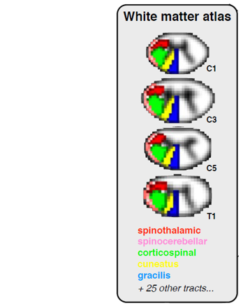
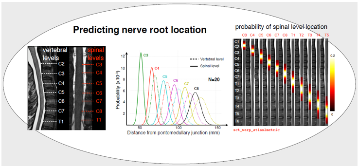

SCT Concepts
############

This section documents some SCT concepts and other useful things to know.

.. contents::
   :local:
..

Voxels Space Orientation and Coordinate Conventions
***************************************************

Images
======

It is important to note that SCT Images, which are derived from NIFTI
images, have their contents indexed in “Fortran order”, meaning that in
an image of shape :math:`(N_a, N_b, N_c)`, where we consider the `a`
axis to be the first, two consecutive (in the sense of storage location)
elements are in the `a` dimension, the first.
This is by opposition to the C ordering which is more widely used in
most software, and where the fastest varying element is indexed last.

Reference Spaces
================

As in many other tools, SCT follows a standard nomenclature for reference
spaces in which the world or local coordinates are expressed.

The string is formed from character label among (relative to a human subject):

- `L` / `R`: left-right
- `P` / `A`: posterior-anterior
- `I` / `S`: inferior-superior

The character position corresponds to the axis index.

SCT uses the "from" convention, which for clarity we postfix by a
dash.

The reference space for physical coordinates is LPI- (which is coming
from nibabel and NIFTI).

An “image orientation” corresponds to the orientation of the
surface/volume with regard to the reference orientation.
It is encoded in the (NIFTI) file header.

For example, a `RAS` image orientation corresponds to a 3D image with:

- X axis oriented `L` towards `R`;
- Y axis oriented `P` towards `A`;
- Z axis oriented `I` towards `S`.

Notes:

- nibabel, BIDS
  are using the "towards" convention, ie. SCT's LPI(-) is their RAS(+).

Coordinate Conventions
======================

Local/Voxel Coordinates
+++++++++++++++++++++++

When voxel coordinates are integers, coordinates are indices.
Indices are expressed starting from 0 and up to N-1 where N is the
number of voxels in the considered dimension.

When voxel coordinates are real numbers, we are using an *integer
voxel center convention* (consistent with nibabel and NIFTI).

This means that a coordinate such as :code:`(i,j,k) == np.round((i,j,k))`
expresses the center of a voxel.

NB: Voxel coordinates are called :math:`(i,j,k)` in the NIFTI
documentation.

Global/Physical Coordinates
+++++++++++++++++++++++++++

Physical coordinates are always expressed as real numbers.
They are defined from the relation expressed by the transform and unit
system expressed in a image header.

Physical coordinates are expressed relative to the LPI- frame,
considering the voxel dimensions, affine transform between voxel
coordinates and world coordinates, and the physical dimension unit,
all of which is encoded in the NIFTI file header.

NB: Voxel coordinates are called :math:`(x,y,z)` in the NIFTI
documentation.

References
==========

- `An introduction to the NIFTI file format. <https://brainder.org/2012/09/23/the-nifti-file-format/>`_
  See *§ Orientation information* and around.

- `Official definition of the nifti1 header <https://nifti.nimh.nih.gov/pub/dist/src/niftilib/nifti1.h>`_
  See *§ 3D IMAGE (VOLUME) ORIENTATION AND LOCATION IN SPACE*

- `nipy/nibabel's documentation on coordinate systems
  <http://nipy.org/nibabel/coordinate_systems.html#naming-reference-spaces>`_

- ITK (`ANTs <https://sourceforge.net/p/advants/discussion/840261/thread/2a1e9307/#fb5a>`_,
  `Slicer <https://www.slicer.org/wiki/Coordinate_systems>`_) reference coordinate system is different (LPS-).

- `Matlab FieldTrip toolbox “How are the different head and MRI coordinate systems defined?”
  <http://www.fieldtriptoolbox.org/faq/how_are_the_different_head_and_mri_coordinate_systems_defined>`_

Template / Atlas
****************

Background information on templates:

- `*A Brief History of Advanced Normalization Tools (ANTs)*
  by Brian B. Avants (PENN) and Nicholas J. Tustison (UVA)
  <https://stnava.github.io/ANTsTalk/#/>`_

Repository for creating SCT's templates:

- `PAM50 anatomical template <https://github.com/neuropoly/template>`_

- `White matter atlas <https://github.com/neuropoly/spinalcordtoolbox/tree/master/dev/atlas>`_

- `Spinal levels <https://github.com/neuropoly/spinalcordtoolbox/tree/master/dev/spinal_level>`_

White matter atlas
==================

The White Matter atlas will be a useful tool for your studies of specific spinal cord tracts. It consists of 30 nifti
volumes named ``PAM50_atlas_<tract_number>.nii.gz`` where ``<tract_number>`` is the number identifying the tract.
Fifteen tracts for each side are available. The values of each voxel of the files ``PAM50_atlas_<tract_number>.nii.gz``
are the voxel volume proportions occupied by the corresponding tract.

The atlas is stored in the ``data/PAM50/atlas`` folder, and comes with a text file (``info_label.txt``) that provides a
more detailed breakdown of each tract.

**Reference:** `Benhamou M, Fonov V, Taso M, Le Troter A, Sdika M, Collins DL, Callot V, Cohen-Adad J. Atlas of
white-matter tracts in the human spinal cord. Proceedings of the 22th Annual Meeting of ISMRM, Milan, Italy 2014:0013
<https://dl.dropboxusercontent.com/u/20592661/publications/benhamou_irmsm14.pdf>`_.

Spinal levels
=============

In the folder ``data/PAM50/spinal_levels``, you will find 11 nifti files, each one corresponding to one spinal level of
the spinal cord from C3 to T5. On the illustration above, you can see the spinal levels C4 (red-yellow) and T1
(blue-lightblue). In each nifti file, the value of each voxel is the probability for this voxel to belong to the
spinal level.

**Reference:** `Cadotte DW, Cadotte A, Cohen-Adad J, Fleet D, Livne M, Mikulis D, Fehlings MG. Resolving the anatomic
variability of the human cervical spinal cord: a solution to facilitate advanced neural imaging. Proceedings of the
22th Annual Meeting of ISMRM, Milan, Italy 2014:1719
<https://dl.dropboxusercontent.com/u/20592661/publications/cadotte_ismrm14.pdf>`_.

Temporary Directories
*********************

Many SCT commands will create temporary folders to operate,
and there is an option to avoid removing temporary directories, to be
used for troubleshooting purposes.

If you don't know where your temporary directory is located, you can
look at:
https://docs.python.org/3/library/tempfile.html#tempfile.gettempdir

.. _qc:

Quality Control
***************

Some SCT tools can generate Quality Control (QC) reports.
These reports consist in “appendable” HTML files, containing a table
of entries and allowing to show, for each entry, animated images
(background with overlay on and off).

To generate a QC report, add the `-qc` command-line argument,
with the location (folder, to be created by the SCT tool),
where the QC files should be generated.
