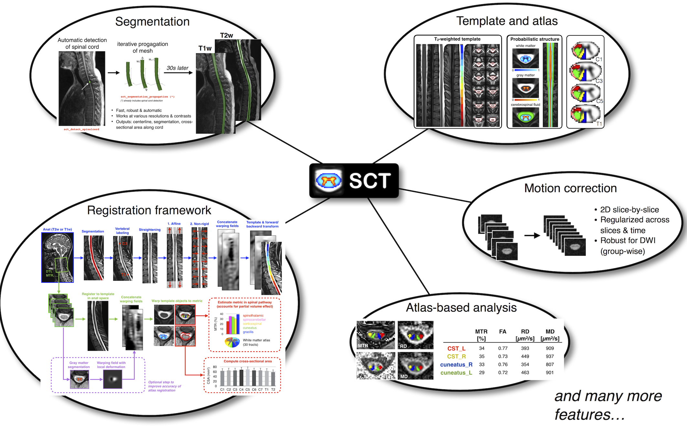

Overview
########

SCT tools process MRI data (`NIfTI <https://nifti.nimh.nih.gov/>`_ files) and can do fully automatic tasks such as:

- Segmentation of the spinal cord and gray matter
- Segmentation of pathologies (eg. multiple sclerosis lesions)
- Detection of anatomical highlights (e.g. ponto-medullary junction, spinal cord centerline, vertebral levels)
- Registration to template, and deformation (e.g. straightening)
- Motion correction for diffusion and functional MRI time series
- Computation of quantitative MRI metrics (e.g. diffusion tensor imaging, magnetization transfer)
- Texture analysis (e.g. grey level co-occurrence matrix)
- Extraction of metrics within anatomical regions (e.g. white matter tracts)

SCT also has low-level tools:

- Help out with manual labeling and segmentation with a Graphical User Interface (GUI)
- GUI plugin for `FSLeyes <https://users.fmrib.ox.ac.uk/~paulmc/fsleyes/userdoc/latest/>`_
- Warping field creation and application
- NIFTI volume manipulation tools for common operations

You may now proceed to :ref:`installation` and :ref:`getting-started`.
