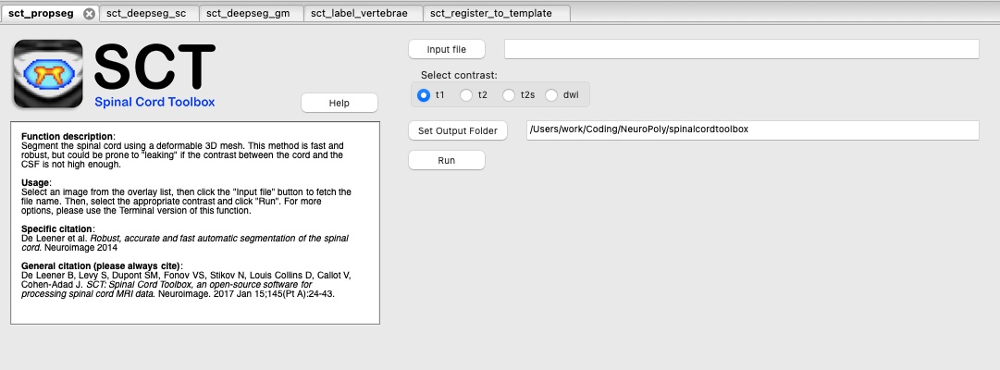

.. _fsleyes_integration:

*******************
FSLeyes Integration
*******************

`FSLeyes <https://fsl.fmrib.ox.ac.uk/fsl/fslwiki/FSLeyes>`_
is part of the larger `FSL <https://fsl.fmrib.ox.ac.uk/fsl/fslwiki>`_ package, which is a library
containing tools for FMRI, MRI, and DTI brain imaging data. ``FSLeyes`` is the image viewer for this package, and can
be installed as either part of the ``FSL`` package, or as a standalone app.

Previously, SCT provided instructions on how to install FSLeyes into the SCT environment. However, we now request that you install FSLeyes separately and manage the installation on your own. You can find installation instructions for FSLeyes at `this link <https://fsl.fmrib.ox.ac.uk/fsl/fslwiki/FSLeyes>`_.

.. warning::

   If you choose to install FSLeyes via a complete FSL installation, you will need to update 'wxpython' (an internal package used by FSLeyes). This is because the version of 'wxpython' that comes with FSL is out of date (`more info here <https://github.com/spinalcordtoolbox/spinalcordtoolbox/issues/3988#issuecomment-1373918661>`_).

   To update, please run one of the the following commands (`depending on your FSL version <https://fsl.fmrib.ox.ac.uk/fsl/fslwiki/FSLeyes>`_):

   .. note:: The terminal commands in these instructions may require administrative privileges, depending on where you have installed FSL.

   **FSL 6.0.6 or newer:**

   .. code:: sh

      $FSLDIR/bin/conda update -n base wxpython

   **FSL 6.0.2 to 6.0.5.2:**

   .. code:: sh

      $FSLDIR/fslpython/bin/conda update -n fslpython -c conda-forge --update-all wxpython

   Then, restart FSLeyes.

SCT + FSLeyes
=============

``SCT`` has a plugin script that can be used with the ``FSLeyes`` interface (GUI).

To enable the ``SCT`` plugin:

1. Open ``FSLeyes`` application.
2. ``File`` -> ``Run script``
3. Select the script ``spinalcordtoolbox/contrib/fsl_integration/sct_plugin.py``

You should see something like this appear in the ``FSLeyes`` interface:

Demonstration
=============

The YouTube video below demonstrates the FSLeyes plugin in action:

.. raw:: html

   <iframe width="560" height="315" src="https://www.youtube.com/embed/XC0vu0brEB0" title="YouTube video player" frameborder="0" allow="accelerometer; autoplay; clipboard-write; encrypted-media; gyroscope; picture-in-picture" allowfullscreen></iframe>
