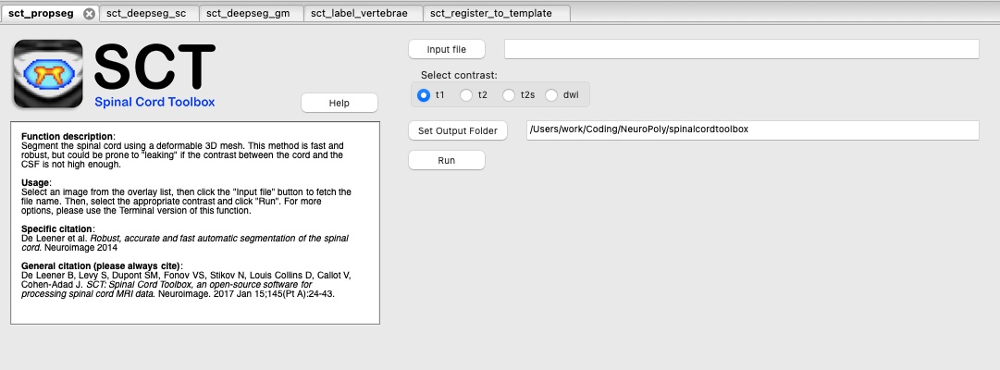

.. _fsleyes_integration:

*******************
FSLeyes Integration
*******************

`FSLeyes <https://fsl.fmrib.ox.ac.uk/fsl/fslwiki/FSLeyes>`_
is part of the larger `FSL <https://fsl.fmrib.ox.ac.uk/fsl/fslwiki>`_ package, which is a library
containing tools for FMRI, MRI, and DTI brain imaging data. ``FSLeyes`` is the image viewer for this package, and can
be installed as either part of the ``FSL`` package, or as a standalone app.

Previously, SCT provided instructions on how to install FSLeyes into the SCT environment. However, we now request that you install FSLeyes separately and manage the installation on your own. You can find installation instructions for FSLeyes at `this link <https://fsl.fmrib.ox.ac.uk/fsl/fslwiki/FSLeyes>`_.

SCT + FSLeyes
=============

``SCT`` has a plugin script that can be used with the ``FSLeyes`` interface (GUI).

To enable the ``SCT`` plugin:

1. Open ``FSLeyes`` application.
2. ``File`` -> ``Run script``
3. Select the script ``spinalcordtoolbox/contrib/fsl_integration/sct_plugin.py``

You should see something like this appear in the ``FSLeyes`` interface:

Demonstration
=============

The YouTube video below demonstrates the FSLeyes plugin in action:

.. raw:: html

   <iframe width="560" height="315" src="https://www.youtube.com/embed/XC0vu0brEB0" title="YouTube video player" frameborder="0" allow="accelerometer; autoplay; clipboard-write; encrypted-media; gyroscope; picture-in-picture" allowfullscreen></iframe>